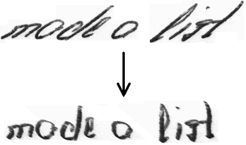

# Deslanting Algorithm

**Algorithm removes cursive writing style | Handwritten Text Recognition | C++ | OpenCV | OpenCL**

This algorithm sets (handwritten) text in images upright, i.e. it removes the cursive writing style.
It is used as a preprocessing step for handwritten text recognition.
The following illustration shows input and output of the algorithm for a given image (```data/test1.png```).



Two implementations are provided:
* CPU: all computations are done on the CPU using OpenCV.
* GPU: each column and shear angle is processed in parallel using OpenCL to calculate the best shear angle, the remaining work is done on the CPU using OpenCV.


## Getting started

Build **CPU** implementation on Linux (OpenCV must be installed):
```g++ --std=c++11 src/cpp/main.cpp src/cpp/DeslantImgCPU.cpp `pkg-config --cflags --libs opencv` -o DeslantImg ```

Build **CPU and GPU** implementation on Linux (OpenCV and OpenGL must be installed). 
If the macro **USE_GPU** is defined in main.cpp, the computation takes place on the GPU:
```g++ --std=c++11 src/cpp/main.cpp src/cpp/DeslantImgCPU.cpp src/cpp/DeslantImgGPU.cpp src/cpp/CLWrapper.cpp `pkg-config --cflags --libs opencv` -lOpenCL -o DeslantImg```


Deslant the two images provided in the ```data/``` directory (taken from IAM dataset \[2\]) and write output to the root directory of the repository:
```./DeslantImg```

This reads the image ```data/test.png``` and outputs the deslanted image ```out.png```.
Implemented in C++ using OpenCV3.
Tested on Windows and Linux using the IAM, Bentham and Ratsprotokolle datasets.


## Documentation

Call function ```deslantImg(img, bgcolor)``` with the input image (grayscale) and the background color (to fill empty image space).
It returns the deslanted image computed on the **CPU**.

```
#include "DeslantImgCPU.hpp"
...

// read grayscale image
const cv::Mat img = cv::imread("data/test1.png", cv::IMREAD_GRAYSCALE);

// deslant it
cv::Mat res = htr::deslantImg(img, 255);

// and save the result
cv::imwrite("out1.png", res);
```

The **GPU** version additionally takes an instance of ```CLWrapper``` which holds all relevant information needed for OpenCL: ```deslantImg(img, bgcolor, clWrapper)```.
As the construction of a ```CLWrapper``` instance takes time, it makes sense to only create one instance and use it for all future calls to ```deslantImg(img, bgcolor, clWrapper)```. 

```
#include "DeslantImgGPU.hpp"
...

// read grayscale image
const cv::Mat img = cv::imread("data/test1.png", cv::IMREAD_GRAYSCALE);

// deslant it
htr::CLWrapper clWrapper;
cv::Mat res = htr::deslantImg(img, 255, clWrapper);

// and save the result
cv::imwrite("out1.png", res);
```


## Algorithm 

Vinciarelli and Luettin describe the algorithm in their paper \[1].
Here is a short outline of the algorithm:


## References

\[1\] Vinciarelli and Luettin - A new normalization technique for cursive handwritten words

\[2\] IAM dataset: http://www.fki.inf.unibe.ch/databases/iam-handwriting-database
