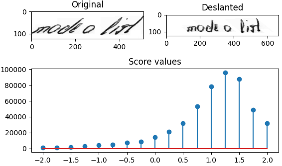

# Deslanting Algorithm

**Update 2021: added Python implementation**

This algorithm sets handwritten text in images upright, i.e. it removes the cursive writing style.
One can use it as a preprocessing step for handwritten text recognition.
The following illustration shows input and output of the algorithm for a given image (`data/test1.png`).


Three implementations are provided:
* Python
* C++: all computations are done on the CPU using OpenCV
* OpenCL: each column and shear angle is processed in parallel using OpenCL to compute the optimal shear angle, the remaining work is done on the CPU using OpenCV


## Installation

### Python

* Install by running `pip install .`
* Run `DeslantImgPlot` (without arguments) to process the images in the `data` directory (images taken from IAM and Bentham dataset)
* This opens a window showing the input image, deslanted image and score values
* The script can be configured via command line, see available options [below](#python-gui), or by running `DeslantImgPlot -h`



### C++ and OpenCL

* Use `./build.sh` to build the CPU version, or `./build.sh gpu` to build the GPU version on Linux using g++  
  Alternatively, use `make` to build the CPU version, or `make GPU=1` to build to GPU version.
* Run `./DeslantImg` to process the images in the `data/` directory
* Two processed images are saved in the repositories root directory

Some notes on how to compile the demo manually and how to compile for Windows or other operating systems:

* Build **CPU** implementation on Linux (OpenCV must be installed, `libopencv-dev`):

        g++ --std=c++11 src/cpp/main.cpp src/cpp/DeslantImgCPU.cpp `pkg-config --cflags --libs opencv` -o DeslantImg

* If the macro **USE_GPU** is defined, the computation takes place on the GPU. To build **CPU and GPU** implementation on Linux (OpenCV _and_ OpenCL must be installed, `libopencv-dev nvidia-opencl-dev`):

        g++ --std=c++11 -D USE_GPU src/cpp/main.cpp src/cpp/DeslantImgCPU.cpp src/cpp/DeslantImgGPU.cpp src/cpp/CLWrapper.cpp `pkg-config --cflags --libs opencv` -lOpenCL -o DeslantImg

* On Windows, the easiest way is to use Microsoft Visual Studio, put all files into a C++ project, set include and library paths for OpenCV and optionally OpenCL, and finally compile and run the program


## Usage

### Python GUI

Command line options of `DeslantImgPlot`:
```
usage: DeslantImgPlot [-h] [--data DATA] [--optim_algo {grid,powell}]
                      [--lower_bound LO] [--upper_bound HI]
                      [--num_steps STEPS] [--bg_color BG]

optional arguments:
  -h, --help            show this help message and exit
  --data DATA           directory containing the (.png|.jpg|.bmp) input images
  --optim_algo {grid,powell}
                        either do grid search, or apply Powell's derivative-
                        free optimizer
  --lower_bound LO      lower bound of shear values
  --upper_bound HI      upper bound of shear values
  --num_steps STEPS     if grid search is used, this argument defines the
                        number if grid points
  --bg_color BG         color to fill the gaps of the sheared image that is
                        returned
```

### C++ CLI

Command line options of `DeslantImg`:
```
Usage: DeslantImg [params] imagein imageout 

	-?, -h, --help, --usage (value:true)
		print this message
	--bg_color (value:255)
		color to fill the gaps of the sheared image that is returned
	--lower_bound (value:-1.0)
		lower bound of shear values
	--upper_bound (value:1.0)
		upper bound of shear values

	imagein (value:-)
		path name to read the input image from (or stdin)
	imageout (value:-)
		path name to write the output image to (or stdout)
```

### C++ API
Call function `deslantImg(img, bgcolor)` with the input image (grayscale), and the background color (to fill empty image space).
It returns the deslanted image computed on the **CPU**.

```C++
#include "DeslantImgCPU.hpp"
...

// read grayscale image
const cv::Mat img = cv::imread("data/test1.png", cv::IMREAD_GRAYSCALE);

// deslant it
const cv::Mat res = htr::deslantImg(img, 255);

// and save the result
cv::imwrite("out1.png", res);
```

### C++ OpenCL API
The GPU version additionally takes an instance of `CLWrapper` which holds all relevant information needed for OpenCL: `deslantImg(img, bgcolor, clWrapper)`.
As the construction of a `CLWrapper` instance takes time, it makes sense to only create one instance and use it for all future calls to `deslantImg(img, bgcolor, clWrapper)`. 

```C++
#include "DeslantImgGPU.hpp"
...

// read grayscale image
const cv::Mat img = cv::imread("data/test1.png", cv::IMREAD_GRAYSCALE);

// deslant it
htr::CLWrapper clWrapper;
const cv::Mat res = htr::deslantImg(img, 255, clWrapper);

// and save the result
cv::imwrite("out1.png", res);
```


## Algorithm 

Vinciarelli and Luettin describe the algorithm in their [2001 paper](http://dx.doi.org/10.1016/S0167-8655(01)00042-3).
Here is a short outline of the algorithm:


